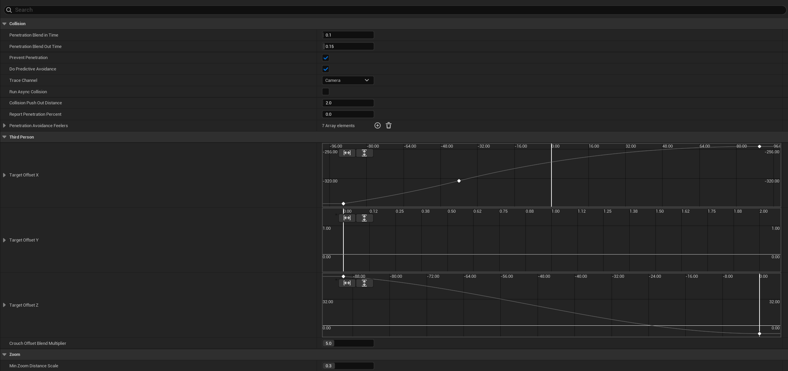

# Modular Camera System

Stack-based Camera System for Unreal Engine, ported from Lyra and improved further. Blend between multiple camera modes (First-person, Third-person, ADS, etc.) with pitch-driven offset curves and wall-penetration avoidance.



## Installation

Get `ModularCameraSystem.zip` from the [releases](https://github.com/Solessfir/ModularCameraSystem/releases) and extract it into your project's `Plugins` folder.

## Quick start

1. Add `CameraModeComponent` to your Character.
2. Create Blueprint `CameraMode` (can use built-in `CameraMode_FirstPerson` or `CameraMode_ThirdPerson`).
3. Add created `CameraMode` to the `CameraModeComponent` -> `Default Camera Mode`

## How mode selection works

Every frame the component calls **Determine Camera Mode**: top of the **Camera Mode Override** stack (pushed via `Push Camera Mode`) if non-empty, otherwise **Default Camera Mode**.

Override `Determine Camera Mode` on a **Blueprint subclass of Camera Mode Component** if you need custom selection logic (e.g. switch TPP/FPP from a bool, or pick a mode from gameplay state).

Each selected mode is **pushed** onto an internal stack and blends in over its own **Blend Time**. Older modes fall away once fully occluded.

Rotation blends follow each mode's continuous angle path, preserving the view when a partially blended mode is promoted. A mode that turns past 180 degrees during a blend continues along that turn instead of switching to the opposite arc.

When selection returns no mode, the stack is cleared and the component restores its saved relative location, rotation, and FOV before using normal camera behavior. While modes are active, they control the view rotation even if **Use Pawn Control Rotation** is enabled.

If a mode callback changes the stack during evaluation, normal camera behavior is used for that frame and the new stack is evaluated on the next frame.

Deactivating or unregistering the component deactivates its modes and sends any outstanding penetration exit notifications.

## Camera Modes

### Base Camera Mode
Abstract base. Drives view Location/Rotation/FOV from the target actor's pivot each frame and blends against the mode below it on the stack.

Create a Blueprint child and override:

- **Get Pivot Location** / **Get Pivot Rotation** - where the camera is anchored
- **Update View** - full control of Location/Rotation/FOV (use the Set View * helpers)
- **On Activation** / **On Deactivation** - enter/exit hooks

Class defaults:

- **Camera Type Tag** - gameplay tag queryable when a kind of mode is active (e.g. ADS) without knowing the class
- **Field Of View / View Pitch Min / View Pitch Max** - view clamps
- **Blend Time / Blend Function / Blend Exponent** - how this mode blends in over the mode(s) below it

### Camera Mode First Person
Pins the camera to a socket/bone on the character mesh (default `head`) instead of the base class's eye-height pivot.

- **Head Socket Name** - socket/bone the camera pivots to
- **Fallback** - Actor Eyes view point if socket is not found

### Camera Mode Third Person
Pitch-driven offset curve (`Target Offset X/Y/Z`) plus wall-penetration avoidance so the camera doesn't clip through geometry. Curves are read from the class defaults every frame, so tweaking them on a Blueprint while PIE is running updates the live camera immediately - no restart needed.

- **Target Offset X/Y/Z** - forward/back, left/right, up/down camera offset, evaluated per-axis using view pitch
- **Crouch Offset Blend Multiplier** - speed the crouch height offset blends in/out
- **Prevent Penetration / Do Predictive Avoidance** - collision avoidance toggles
- **Trace Channel** - collision channel the feelers sweep against (default `Camera`)
- **Run Async Collision** - runs feeler 0's sweep off the game thread; result up to 1 frame stale. Predictive feelers always run async regardless
- **Penetration Avoidance Feelers** - feeler rays swept from the pivot. Index 0 = main collision check, index 1+ = predictive (angled off-axis, ease in before you turn into a wall)

Camera lag (off by default) smooths the pivot itself, not the final offset camera position - so
free-rotating the camera around the target has no lag, only the target's own movement/rotation does:

- **Enable Camera Lag / Enable Camera Rotation Lag** - turn location/rotation smoothing on
- **Camera Lag Speed / Camera Rotation Lag Speed** - how fast it catches up (lower = more lag, 0 = instant/no lag)
- **Camera Lag Max Distance** - caps how far the lagged position may fall behind the pivot (0 = uncapped)
- **Use Camera Lag Substepping** - sub-steps the interpolation for stability at low/fluctuating frame rates
- **Draw Debug Lag Markers** - draws the pivot (green), the lagged position (yellow), and the line between them (red if clamped)

Zoom (Scroll wheel):

- Call **Add Zoom Input** (positive = zoom in) - e.g. `Camera Mode Component → Get Active Camera Mode → Cast To Camera Mode Third Person → Add Zoom Input`
- **Min/Max Zoom Distance Scale** - how close/far zoom can bring the camera (fraction/multiple of the curve's authored distance). Bounds apply without zoom input and after runtime changes.
- **Zoom Step Size** - how much one call moves the target zoom
- **Zoom Interp Speed** - how fast the camera catches up to the target zoom (0 = instant)

## Temporary overrides (Abilities / ADS)

From any Blueprint (Gameplay Ability, character, etc.). Multiple overrides can be pushed at once -
the most recently pushed one wins; pop by class, so it's safe to release out of order:

```
Camera Mode Component → Push Camera Mode (ADS_CameraMode_BP)
// ... ability ends ...
Camera Mode Component → Pop Camera Mode (ADS_CameraMode_BP)
```

## Debugging

Console command `ModularCameraSystem.ShowDebug 1` draws the local player's Camera Mode Component debug info (FOV/location/rotation and every camera mode on the stack with its current blend weight) - no setup needed. Run it again with `0` to turn off.

`Camera Mode Third Person` also logs to the [Visual Logger](https://dev.epicgames.com/documentation/en-us/unreal-engine/visual-logger) under category `LogCameraSystem`: each penetration-avoidance feeler ray (`red` = blocked, `green` = clear) and the final resolved camera location with its blocked percentage.

## Camera Assist Interface (optional)

Implement **Camera Assist Interface** on the Owning Pawn, its Controller, or a custom target returned via `GetCameraPreventPenetrationTarget` if you need to customize penetration behavior.

For custom penetration targets, prefer a capsule, box, or sphere collision root and keep the main feeler small enough to fit inside it. Other collision roots use a nearest-point fallback.

| Event | Purpose |
|---|---|
| **Get Camera Prevent Penetration Target** | Redirect the focal actor away from the view target (return none/null to keep the view target) |
| **Get Ignored Actors For Camera Penetration** | Actors the camera may always pass through (vehicle, extra targets, …) |
| **On Camera Penetrating Target** | Fired once when the camera gets too close (e.g. hide the mesh) |
| **On Camera Stopped Penetrating Target** | Fired once when it's no longer too close (e.g. show the mesh again) |
